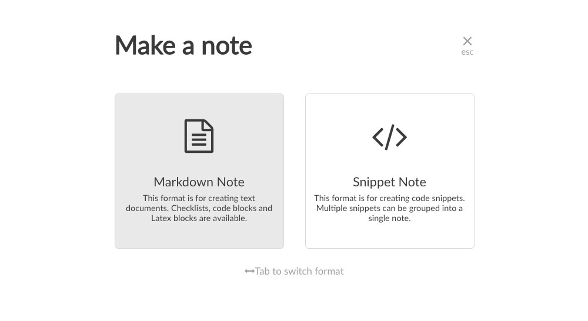

ContentfulのリッチテキストEditorが少し使いづらい、というのはブログにも書いたのですが、では使いやすいというMarkdown Editorの方を使い出したか、というとそうでもなくて。

情報発信よりもまずつくることを目的としているような輩にとって、ブラウザが読んでくれるHTMLを大量に書き出すのに何がいちばん早いか、というと

Emmet で書けるVs codeに勝るものはなく。

実際のところMDでPostを書くよりも、[About](/about/)ページをつくる作業の方が単純で簡単。

これはもう要素はHTMLタグとTextとCSS、レイアウトはCSS Gridでデバイス毎のレスポンシブを分けるだけ。<br>
サイトのHeader Footerなどは既にあるcomponentsを個々に借りてくるまでもなく、Layout componentsを使うだけ。

まだ小規模ですが、こんな単純明快なFSEあるかぁっ　という感覚。<br>
JSファイルの中でEmmetを使えるようにしてくれるVs code拡張機能もあり、煩わしいのは日本語と半角英数の切り替えだけ、と最低限負荷でできる理想的な環境なわけですが、Pre/Codeだけは中に書けない。

で、やむなき選択肢がMarkdownだった。

<hr>

今のところContentfulには、他のStarterを試したときに自動で作ってくれたContent Modelも使わず放置してあり、いつでもGraphQLで紐付けられるくらいの知見は身についた・・・て大袈裟な。<br>
「GraphQLの使い勝手もわかった、怖くねぇ！くらいになった」今段階で活用しても良いのだけど

結局、この人間とファミレスで雑談してたとして、なんと応えるか。

&emsp;<br>
<blockquote>
・・・君はつまり「Github Pages」とBlogのようなものが両方あればいいんじゃない？
</blockquote>

<br>&emsp;<br>
翻訳するとファイルをPutするだけで良い環境と、入力するだけで新規ファイルをCMSに追加してくれる便利ツールの両方あれば満足なんだろう。<br>
とはとっくに気づいていたわけで、そのように整えた。

&emsp;<br>

GatsbyのThemaを「複数・同居させられる」という機能とは違うものの<br>
そんなことまで出来るフレームワークで、リッチテキストとMarkdown、CMSとリポジトリ、使い分けるのは容易かろう⭐️
で作業スタート。

&emsp;<br>
一応まじめにOutput/Inputのバランスとコストは30分くらい（うーん。）と比較検討してみました。

現状での欠点としては、「Contentful Tags」で両コンテンツを跨いでの検索はできない - がOutputの唯一欠陥と見えますが、Inputコストが高いと続かないため、ここはOutput/Inputで「Input」を優先するなど「二択・双六」したですね。
<br>
<blockquote>
あれ。雑誌でよくあるYes or Noで進んでいくと、あなたはAタイプBタイプ・・・と結果が4種類くらいあるやつ、なんと呼ぶんだろう。（思いつくのはイフゼン文・図）<br>・・・ぐ。やはり気になってググったら「Yes/Noチャート」だそう
</blockquote>
<br>

・・・と脱線から戻って、そもNotesの方では検索やTag絞りなど必要ない。と思っていても、「人は気が変わるし、状況も変わる」と前提した場合に、**実装しようと思ったら出来る** 許容範囲も見えてくる。

Jekyll資産だという「frontmatter」は好きなときに好きなだけ増やせる、ということは[BlogにTags機能をつける工程](/note-03/) で使った

```js:title=createPage
context: {
	slug: tag.contentful_id,
	name: tag.name,
	},
```
```js:title=ID&name
const =	result.data.allContentfulTag.nodes.contentful_id
const =	result.data.allContentfulTag.nodes.name
```
住所番地と名前を持った（値）と合同フィルターをかけられる（値）をMD「frontmatter」側にも追加すれば良いと想定した場合に。<br>数学の・・・いや算数か？ &emsp; 最小公倍数、最大公約数の円が重なった図解に似たことを、遠い将来もしやりたくなったとき、CMSを通したMDよりローカルリポジトリにあるMDが楽そうだ。

などなど。後述する公開の手間の差とかを比較。
<hr>

Inputでの欠点は、ただひたすら私の不当なMarkdown毛嫌いだけ（汗）<br>
**彼女はHTMLというMarkup言語を愛しすぎてる** &emsp; 問題とでも呼ぼうか、インデントのないテキストが苦しみに至る病と呼ぶべきか。

ようやく4つめ記事で慣れてはきたけども。<br>

# このHeadingもろくに書かぬ手抜きに至る

とまぁ、contentsの善し悪しは所詮人間性だべや。な点には睫毛を伏せて応えまして、先へ進む。
<br>&emsp;<br>


CMSのMarkdown Editorに頼らない場合、Previewはどうするんだ - な点。<br>

一般的には、記事一つ書くのにGtasby developで開発環境を立ち上げて・・というのは現実的でないからみなさんCMSを使うという側面もあると思う。

が、うちの場合はiTermが閉じてることはないので、これが最短であったりする。<br>
開発と本番でプッシュ先のリポジトリ切り替えはするけれども、だからこそ遠慮なく下書きも残せるのと<br>
ホットリロード > Preview　の確実性。<br>
&emsp;<br>

あとは、Markdownを単体書きしたいときのツールは、自前でというか、先に自己調達でアプリを持っていたので、Localhostが寝ている時も角だけは書ける。


これは先に自前で、じゃなく自己調達でアプリを持っていた。<br>
現在広く知られている「Boost Note」の前身のローカル版「Boost Note」を、最近一代前のiMacからコピペ移植してきて、非常に重宝している。<br>
使いやすさ以前に、ネットワーク越しにアプリをコピー＆ペーストですぐ使えた

一代前
長年未使用だったくせに


Markdownの弱みは改行コード周りが曖昧、というか「縦スペースの表現が苦手」<br>
だからってBRタグを連続挿入して良いのかって・・・悩ましいが<br>

むかし人はタイプライターで、キャリッジリターン、リターン・リターンで


&emsp;


<br><br><br><br>


SCSSがあれば何でも出来る
レジェンドだという
両刀で行くのは容易かろ


倒置法人間


デザイナーともフロントエンドとも
Header Footer

（SCSS.module）

日本語という2byte


良きGatsby体験


<br><br><br><br><br><br>


Jekyll - GitHub Pages


Hard Coding Notes


ブログで


MovableType.jp 

Static query
Static sites are great

Contentfulはリッチテキストのエディター以外は文句のつけようのない
Netlify