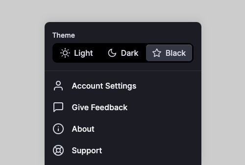

<div style="text-align: center;">
<svg xmlns="http://www.w3.org/2000/svg" xmlns:xlink="http://www.w3.org/1999/xlink" aria-hidden="true" role="img" class="iconify iconify--logos" width="250" height="auto" preserveAspectRatio="xMidYMid meet" viewBox="0 0 256 228"><path fill="#00D8FF" d="M210.483 73.824a171.49 171.49 0 0 0-8.24-2.597c.465-1.9.893-3.777 1.273-5.621c6.238-30.281 2.16-54.676-11.769-62.708c-13.355-7.7-35.196.329-57.254 19.526a171.23 171.23 0 0 0-6.375 5.848a155.866 155.866 0 0 0-4.241-3.917C100.759 3.829 77.587-4.822 63.673 3.233C50.33 10.957 46.379 33.89 51.995 62.588a170.974 170.974 0 0 0 1.892 8.48c-3.28.932-6.445 1.924-9.474 2.98C17.309 83.498 0 98.307 0 113.668c0 15.865 18.582 31.778 46.812 41.427a145.52 145.52 0 0 0 6.921 2.165a167.467 167.467 0 0 0-2.01 9.138c-5.354 28.2-1.173 50.591 12.134 58.266c13.744 7.926 36.812-.22 59.273-19.855a145.567 145.567 0 0 0 5.342-4.923a168.064 168.064 0 0 0 6.92 6.314c21.758 18.722 43.246 26.282 56.54 18.586c13.731-7.949 18.194-32.003 12.4-61.268a145.016 145.016 0 0 0-1.535-6.842c1.62-.48 3.21-.974 4.76-1.488c29.348-9.723 48.443-25.443 48.443-41.52c0-15.417-17.868-30.326-45.517-39.844Zm-6.365 70.984c-1.4.463-2.836.91-4.3 1.345c-3.24-10.257-7.612-21.163-12.963-32.432c5.106-11 9.31-21.767 12.459-31.957c2.619.758 5.16 1.557 7.61 2.4c23.69 8.156 38.14 20.213 38.14 29.504c0 9.896-15.606 22.743-40.946 31.14Zm-10.514 20.834c2.562 12.94 2.927 24.64 1.23 33.787c-1.524 8.219-4.59 13.698-8.382 15.893c-8.067 4.67-25.32-1.4-43.927-17.412a156.726 156.726 0 0 1-6.437-5.87c7.214-7.889 14.423-17.06 21.459-27.246c12.376-1.098 24.068-2.894 34.671-5.345a134.17 134.17 0 0 1 1.386 6.193ZM87.276 214.515c-7.882 2.783-14.16 2.863-17.955.675c-8.075-4.657-11.432-22.636-6.853-46.752a156.923 156.923 0 0 1 1.869-8.499c10.486 2.32 22.093 3.988 34.498 4.994c7.084 9.967 14.501 19.128 21.976 27.15a134.668 134.668 0 0 1-4.877 4.492c-9.933 8.682-19.886 14.842-28.658 17.94ZM50.35 144.747c-12.483-4.267-22.792-9.812-29.858-15.863c-6.35-5.437-9.555-10.836-9.555-15.216c0-9.322 13.897-21.212 37.076-29.293c2.813-.98 5.757-1.905 8.812-2.773c3.204 10.42 7.406 21.315 12.477 32.332c-5.137 11.18-9.399 22.249-12.634 32.792a134.718 134.718 0 0 1-6.318-1.979Zm12.378-84.26c-4.811-24.587-1.616-43.134 6.425-47.789c8.564-4.958 27.502 2.111 47.463 19.835a144.318 144.318 0 0 1 3.841 3.545c-7.438 7.987-14.787 17.08-21.808 26.988c-12.04 1.116-23.565 2.908-34.161 5.309a160.342 160.342 0 0 1-1.76-7.887Zm110.427 27.268a347.8 347.8 0 0 0-7.785-12.803c8.168 1.033 15.994 2.404 23.343 4.08c-2.206 7.072-4.956 14.465-8.193 22.045a381.151 381.151 0 0 0-7.365-13.322Zm-45.032-43.861c5.044 5.465 10.096 11.566 15.065 18.186a322.04 322.04 0 0 0-30.257-.006c4.974-6.559 10.069-12.652 15.192-18.18ZM82.802 87.83a323.167 323.167 0 0 0-7.227 13.238c-3.184-7.553-5.909-14.98-8.134-22.152c7.304-1.634 15.093-2.97 23.209-3.984a321.524 321.524 0 0 0-7.848 12.897Zm8.081 65.352c-8.385-.936-16.291-2.203-23.593-3.793c2.26-7.3 5.045-14.885 8.298-22.6a321.187 321.187 0 0 0 7.257 13.246c2.594 4.48 5.28 8.868 8.038 13.147Zm37.542 31.03c-5.184-5.592-10.354-11.779-15.403-18.433c4.902.192 9.899.29 14.978.29c5.218 0 10.376-.117 15.453-.343c-4.985 6.774-10.018 12.97-15.028 18.486Zm52.198-57.817c3.422 7.8 6.306 15.345 8.596 22.52c-7.422 1.694-15.436 3.058-23.88 4.071a382.417 382.417 0 0 0 7.859-13.026a347.403 347.403 0 0 0 7.425-13.565Zm-16.898 8.101a358.557 358.557 0 0 1-12.281 19.815a329.4 329.4 0 0 1-23.444.823c-7.967 0-15.716-.248-23.178-.732a310.202 310.202 0 0 1-12.513-19.846h.001a307.41 307.41 0 0 1-10.923-20.627a310.278 310.278 0 0 1 10.89-20.637l-.001.001a307.318 307.318 0 0 1 12.413-19.761c7.613-.576 15.42-.876 23.31-.876H128c7.926 0 15.743.303 23.354.883a329.357 329.357 0 0 1 12.335 19.695a358.489 358.489 0 0 1 11.036 20.54a329.472 329.472 0 0 1-11 20.722Zm22.56-122.124c8.572 4.944 11.906 24.881 6.52 51.026c-.344 1.668-.73 3.367-1.15 5.09c-10.622-2.452-22.155-4.275-34.23-5.408c-7.034-10.017-14.323-19.124-21.64-27.008a160.789 160.789 0 0 1 5.888-5.4c18.9-16.447 36.564-22.941 44.612-18.3ZM128 90.808c12.625 0 22.86 10.235 22.86 22.86s-10.235 22.86-22.86 22.86s-22.86-10.235-22.86-22.86s10.235-22.86 22.86-22.86Z"></path></svg>
</div>

<details open>
  <summary>もくじ</summary>

- [感想](#感想)
- [サンプル（別タブ）](#sample)
- [要件](#要件)
- [工程](#工程)
- [localStorageとは](#localStorageとは)
- [設計変更](#設計変更)
- [Gatsby Buildエラー](#Gatsby-Buildエラー)
- [バカみたいに当たり前なこと](#バカみたいに当たり前なこと)
- [Buttonアクション](#Buttonアクション)
- [Relodeアクションしてみるまでの右往左往](#Relodeアクションしてみるまでの右往左往)

</details>

<section style="margin-top: 5em;margin-bottom: 5em;" id="感想">

# 感想
このサイトはContentful製 : [starter-gatsby-blog](https://www.gatsbyjs.com/starters/contentful/starter-gatsby-blog)からはじまっているので、
[Blog](/blog)ページだけ趣が違うというか、ほぼ原型。<br>
もともと白ベースで作られていたのを見慣れていたから、前回プラグインで実装したときは、自分はほとんど使うことはなかった。

ただし閲覧者は別。ダークモード対応するしないは、配慮の問題と考えている。

<hr>

かなり前に、Webクリエーターボックス : <span class="crimson-col">[ダークモードに対応していないWebサイトを無理やりダークモードにする拡張](https://www.webcreatorbox.com/webinfo/darkmode-extensions)</span>を読んだとき、先に書かれた[Webサイトをダークモードに対応させよう](https://www.webcreatorbox.com/tech/dark-mode)という記事ではよく理解していなかった「スターバースト現象」というものに （え？！） となり、以来ダークモードを実装するなら極力、背景色「#000;」

自分が不要でも、World wide Webに25年も浸かってきた人間が余力あるなら、つけとけよ！ てな感覚に変化した。
ただし自分は「真っ黒黒」が苦手で持ち腐れていたわけだが、今回は理想としていたー Light / Dark / Black ーの3択タイプにしたので、晴れて好みの色を設定できたダークモードを活用している。

<hr>

情けは人の為ならず。<br>
案外、居心地良い。編集画面とアウトプットで色が違う2画面とか、デュアルディスプレイ甲斐があるっ<br>

色で判断したい獣タイプなんでね、丸の内線と銀座線が赤と黄色じゃなくなった長い期間・・・どれほど乗り越しと乗り間違えをやらかしたことか。

堕落してない人はきっとわからないでしょう。脳のキャパシティーを使わないためなら、けっこうマメに手も体も動かすんですよ怠惰なわたくしも。（何の話だ）

<hr>

# サンプル<a name="sample"></a>

<a href="https://studiomic.github.io/blackmode/" target="_blank" rel="noopener noreferrer">Darkmode+3Type</a>

このサイトとまったく同じものですが。ナビゲーションだけにしてあるソースが<br>
<a href="https://github.com/studiomic/studiomic.github.io/blob/Dark-Lighe-Black-mode/mode/src/components/mode.js#L12" target="_blank" rel="noopener noreferrer">studiomic.github.io/mode at Dark-Lighe-Black-mode</a>

</section>

<section style="margin-top: 5em;margin-bottom: 5em;" id="要件">

# 要件

1. @media (prefers-color-scheme: dark) 対応はせずユーザーアクション主体（予定）
1. 背景色 #000; == 完全ダークモードをBlackモードとして3択にする（擬似MDN）
1. ページ毎動作ではなく設定保持でわずらわしくないのが良い（localStorage）
1. 後日気が変わって　1.はOSカラースキームを開始点にした（初回のみ）

<hr>

言うてしまえば、「use-dark-mode」プラグインで配置していたものより質落ちはNG。<br>
理想は、[MDN](https://developer.mozilla.org/ja/) 以外では実例を見た事がないのだが・・・前々から「3択」にしたかった。

MDNの場合は
- OS Default
- Light
- Dark
という3択になっており、OSはダークモードにしていても、Webはライトモードで読みたいときもある・・・という私のようなユーザーには垂涎もの。


とはいえ<strong>[OS Default]</strong>は昼夜で変わるオートモードにしていないかぎり、Light・Darkと重複するのが惜しい。

<hr>


また先の「スターバースト現象」を知って、ユーザーエクスペリエンスを謳うならダークモードは背景「#000;」一択やないかーい。と思っていた流れで過去にも書いていたのを引用する。

<hr>

> 外観としては、Codepenで見かけた<a href="https://codepen.io/havardob/pen/dyOJyje" target="_blank" rel="noopener noreferrer">Light / Dark / Black Theme</a>が全員嬉しい感。



> ダークモードでも発色ゼロの漆黒Blackじゃないと目にきびしいという方もいれば、私は逆に「#000000」は、きつすぎてエディターのテーマなどでも敬遠します。<br>
> 「濃灰色」止まり。

> このCodepenのをlocalStorage保存つきで実装できれば便利だと思うものの、書けない。

<hr>

と、そのときは思ってプラグインを導入したわけだが、Gatsby Cloud → Netlify移転で元の木阿弥、まっさら白紙に戻ったこの機会に<strong class="crimson-col">3択モード</strong>を実装することにした。

</section>

<section style="margin-bottom: 5em;" id="工程">

# 工程

1. まずはVanilla JSでサクッと書き出し
1. Gatsby BuildでlocalStorageの扱いがまずいわ、と叱られ対処
1. React Hook（useEffect）の使い方を見直して、完成

<br>
と行くまでに、けっこう重要だったかも！なのが

外観はともかく、インプットを<strong>checkbox</strong>にするか<strong>button</strong>にするかで面倒くささが違う。<br>
<strong>checkbox</strong>でも<strong>radio</strong>でも、状態が遷移するものは当然アウトプット用の返り値を書かないとならんし、特に<strong>checkbox</strong>など同じ<strong>name</strong>属性を複数につけられるものは、For文で洗いださないと「動作」があった：という根拠にできないので更に面倒だ。と後で気づいた。

<strong>button</strong>は単に押されたかどうか、のみでトリガーにできるのが重宝。

という脱線から戻って、<u>1.Vanilla JS</u>での書き方はわりと流通していると思う。<br>
ナビゲーションを上部で固定、なんて時にも使う「後から当該エレメントにCSSクラスを加筆したり消去したり」しろよーという<strong>add / remove</strong>

<hr>


````js:title=localStorageから設定キーの値を取り出す
let modeType = localStorage.getItem('mode');

if ( modeType === 'darkmode') {
  document.documentElement.classList.add("darkmode");
  document.documentElement.classList.remove("lightmode","blackmode");

} else if ( modeType === 'blackmode') {
  document.documentElement.classList.add("blackmode");
  document.documentElement.classList.remove("darkmode","lightmode");

} else if ( modeType === 'lightmode') {
  document.documentElement.classList.add("lightmode");
  document.documentElement.classList.remove("darkmode","blackmode");

} else {

}
````

- 1行目でローカルストレージに値があるか変数：<strong>modeType</strong>へ代入し、🟰ダークモードなら、🟰ライトモードなら、と<strong>classList.add</strong>設定/<strong>classList.remove</strong>消去を振り分けるのだが
- <strong>document.body</strong>ではなく<strong>document.documentElement</strong>に施している。bodyではなく htmlにclass付けする場合


````css
html {
  background-color: var(--background);
  transition: background-color .5s ease;
}
````

<strong>body</strong>にbackground-color:は設定せず、<strong>html</strong>に置き換え用変数を設定しておく。

<hr>

</section>

<section style="margin-bottom: 6em;" id="localStorageとは">

# localStorageとは

localStorageは、[Amazonの「最近見た商品」などにも使われているらしい](https://webliker.info/web-skill/how-to-use-localstrage/)・・・が、ここではたった一つのキーなのでブラウザのデベロッパーツールで一目瞭然。<br>

<div style="margin: 3em 0;">

</div>
アプリケーション：ストレージ：ローカルストレージ・（mode）Keyが<br>
onClick={Light}・{Dark}・{Black}を押すたびに、<br>値（lightmode・darkmode・blackmode）と入れ替わる。

localStorage.clear(); で消去しないかぎり永続的なローカルストレージの下には、セッションストレージの文字が見えますね（画像左下）

SessionStorageは、別タブとは共有しないそうで、閉じたら終わり。

<hr>

具体的な使用例は<a href="https://www.freecodecamp.org/japanese/news/how-to-use-localstorage-with-react-hooks-to-set-and-get-items/" target="_blank" rel="noopener noreferrer">React Hooks を使って localStorage のデータを保存・取得する方法</a>という翻訳ページが秀逸。

<blockquote>
localStorage は、JavaScript を用いて作られたサイトやアプリが、有効期限なしでウェブブラウザにキー・バリュー形式のデータを保存するためのウェブストレージオブジェクトです。

つまり、保存されたデータはページを更新したり、ブラウザを再起動しても残ったままです。これは、ブラウザに保存されたデータは、ブラウザウィンドウが閉じられても残ることを意味します。
</blockquote>

</section>


<section style="margin-bottom: 5em;" id="設計変更">

# 設計変更

OSの設定🟰@media (prefers-color-scheme: dark) で対応する場合、毎度OSに合わせて表示し、後から変更できるトグル、でも十分だが。<br>
最初に「ユーザーアクション主体」とした名残を残して、一度でもモード変更ボタンを押した場合はOSよりその値を優先、という書き方にした。

```jsx:title=OS設定がダークモードかの判定をし、true;ならchangeDark処理 
const darkModeMediaQuery = window.matchMedia('(prefers-color-scheme: dark)');
const changeDark = darkModeMediaQuery.matches;
if (changeDark) {
  document.documentElement.classList.add("darkmode");
}
```
localStorageから設定キーを参照して、「空」だった場合は上のコードでOS設定を反映する。<br>
初回来訪者と、モード切り替え履歴のないユーザーがこれにあたる。

<hr>

```jsx:title=localStorage優先で、初回はOS設定を反映するIF文ネスト
useEffect(() => {
  let modeType = localStorage.getItem('mode');

  if ( modeType !== '') {

    if ( modeType === 'darkmode') {
      document.documentElement.classList.add("darkmode");
      document.documentElement.classList.remove("lightmode","blackmode");
    } else if ( modeType === 'blackmode') {
      document.documentElement.classList.add("blackmode");
      document.documentElement.classList.remove("darkmode","lightmode");
    } else {
      document.documentElement.classList.add("lightmode");
      document.documentElement.classList.remove("darkmode","blackmode");
    };

  } else {
    const darkModeMediaQuery = window.matchMedia('(prefers-color-scheme: dark)');
    const changeDark = darkModeMediaQuery.matches;
    if (changeDark) {
      document.documentElement.classList.add("darkmode");
    }
  };
});
```
</section>

<section style="margin-bottom: 5em;" id="Gatsby-Buildエラー">

# Gatsby Buildエラー回避に、useEffectを使用する

工程で、2.Gatsby BuildでlocalStorageの扱いがまずいわ、と叱られ対処　...　と書いた過程。


```jsx
WebpackError: ReferenceError: localStorage is not defined
```

<hr>

開発環境では問題ないが、上のエラーメッセージが出てBuildできない。


エラーメッセージをそのままググり

- [Gatsby.jsでビルド時にlocalStorageのエラーにはuseEffectを使う](https://zenn.dev/koojy/articles/gatsby-localstorage-error)

- [WebpackError: ReferenceError: localStorage is not defined · Issue #14480 · gatsbyjs/gatsby · GitHub](https://github.com/gatsbyjs/gatsby/issues/14480)

を読むも、所詮 { useEffect, useState } の役割をわかっちゃいないのでピンとこない。

先ほどの翻訳ページを読んで、少しずつ文章がちゃんと頭に入ってきたところで、付け焼き刃の対処を続けるとエラーメッセージも変化する。


```jsx
"localStorage" is not available during server-side rendering.
 Enable "DEV_SSR" to debug this during "gatsby develop".

//　翻訳：
「localStorage」は、サーバー側のレンダリング中には使用できません。
「DEV_SSR」を有効にして、「gatsby」中にこれをデバッグします
開発する"。

このエラーの詳細については、ドキュメント ページを参照してください: https://gatsby.dev/debug-html
```
# バカみたいに当たり前なこと<a name="バカみたいに当たり前なこと"></a>

そう。localStorageはブラウザに保管され、参照したり上書きしたり、配列を使ったりできるもの。<br>
所有者：Browserさん。<br>
Node.jsの所有物じゃないんすよね。モジュールでも何でもないもの、Build中に触れるかーっ！

と言われたら、その通りだ。（かなりワタクシの性格的な意訳かかってるけど、）<br>
ReferenceError: localStorage is not defined　（ないものは、ない。参照しようもねぇ、）


<br>
ならぬものはならぬ。会津ですわねぇ。

<hr>

GitHub Issueにあった「コンポーネントがマウントされた後にデータを取得するだけです。」も<br>
Zenn記事曰くの「useEffectでlocalStorageへの参照のタイミングをずらす」<br>
<strong>「エラーを回避する方法としてuseEffect内でlocalStorageを参照するように変更します。」</strong>


<span style="font-size: 1.5em; color:var(--crimson);">意味がわかるとご尤もすぎた。</span>


```jsx:title=useEffect内でlocalStorageを参照する
useEffect(() => {

  let modeType = localStorage.getItem('mode');
  // localStorage参照以降の処理をuseEffectの中に置く

  if ( modeType !== '') {
    // getItem('mode')に値があれば、はじまるIF
    if ( modeType === 'darkmode') {// Dark
    } else if ( modeType === 'blackmode') {// Black
    } else {// Light
    };
  } else {
    // getItem('mode')が空ならOSモード設定に合わせる
  }

});
```

先にやってみたのが、

```js
const handleBeforeUnload = () => {
  console.log('beforeunload')
}
useEffect(() => {
  window.addEventListener('beforeunload', handleBeforeUnload)
  let modeType = localStorage.getItem('mode');
  .....
```

Reactのリロード処理。これを思いつくまで難航した。<br>
・・・アラート出すやつですよね、普通は。
編集中のユーザーが離れようとしたら、このタブ閉じて大丈夫？みたいに訊いてくるやつ。


もっと細かく書かないとアラートは出ないのだが、閉じられる前に保存処理をするから、リロードかけられても先のmode値がlocalStorageに上書きされて「再び開く」


しかしコレ考え過ぎで<strong>useEffect</strong>の中に置くだけで十分でした。<br>
<strong>useEffect</strong>はマンウトしたときに一度だけ実行するもの、なのでブラウザで開いたときに一度だけgetItem('mode');する。この用途に「合っている」と気付けないのがアマチュア。

<hr>
</section>


<section style="margin-bottom: 5em;" id="Buttonアクション">

## Buttonアクション

```js:title=onClick={Light}の動作
let modeType;
  const Light = () => {
    document.documentElement.classList.add("lightmode");
    document.documentElement.classList.remove("darkmode","blackmode");
    modeType = "lightmode";
    localStorage.setItem('mode', modeType);
  };
// const Light = () => {...自分をADD、他2つをREMOVE}
```
5行目で<strong>modeType</strong>(変数)へ<strong>darkmode</strong>(class名)を代入し、
<strong class="primary-col">localStorage</strong>に(key, value)形式で保存。<br>

<strong>let modeType;</strong>は、
<strong>useEffect</strong>内で一度していても、再度ローカル変数宣言が必要。

</section>


<section style="margin-bottom: 3em;" id="Relodeアクションしてみるまでの右往左往">

## Relodeアクションしてみるまでの右往左往

<strong>beforeunload</strong>はさすがに獣道じゃないのか・・・と後日見直して、<strong>useEffect</strong>内で十分とわかったけども、Gatsbyは触るのが面白いので、失敗してもReact学習にもなって、時間を損した気がしないのが良い。<br>
Reactの公式ドキュメントにいたっては日本語版も充実しているし、ありがたいですね。

あとはもう少しスマートなJSが書けたら良いのだけど。

<hr>

</section>
<!-- 
```jsx
import React, { useEffect } from 'react';
import * as styles from '../styles/toggle.module.scss'

const Modebutton = () => {
  useEffect(() => {
    let modeType = localStorage.getItem('mode');

    if ( modeType !== '') {
      if ( modeType === 'darkmode') {
        document.documentElement.classList.add("darkmode");
        document.documentElement.classList.remove("lightmode","blackmode");
      } else if ( modeType === 'blackmode') {
        document.documentElement.classList.add("blackmode");
        document.documentElement.classList.remove("darkmode","lightmode");
      } else {
        document.documentElement.classList.add("lightmode");
        document.documentElement.classList.remove("darkmode","blackmode");
      };
    } else {
      const darkModeMediaQuery = window.matchMedia('(prefers-color-scheme: dark)');
      const changeDark = darkModeMediaQuery.matches;
      if (changeDark) {
        document.documentElement.classList.add("darkmode");
      }
    };
  });

  
  let modeType;
  const Light = () => {
    document.documentElement.classList.add("lightmode");
    document.documentElement.classList.remove("darkmode","blackmode");
    modeType = "lightmode";
    localStorage.setItem('mode', modeType);
  };
  const Dark = () => {
    document.documentElement.classList.add("darkmode");
    document.documentElement.classList.remove("lightmode","blackmode");
    modeType = "darkmode";
    localStorage.setItem('mode', modeType);
  };
  const Black = () => {
    document.documentElement.classList.add("blackmode");
    document.documentElement.classList.remove("darkmode","lightmode");
    modeType = "blackmode";
    localStorage.setItem('mode', modeType);
  };

return (
<div className={styles.modebox}>
    <button type="button" onClick={Light} name="LightMode">
      <svg.../></svg><span>Light</span>
    </button>
    <button type="button" onClick={Dark} name="DarkMode">
      <svg.../></svg><span>Dark</span>
    </button>
    <button type="button" onClick={Black} name="BlackMode">
      <svg.../></svg><span>Black</span>
    </button>
  </div>
  );
};
export default Modebutton
``` -->


<!-- EOF -->