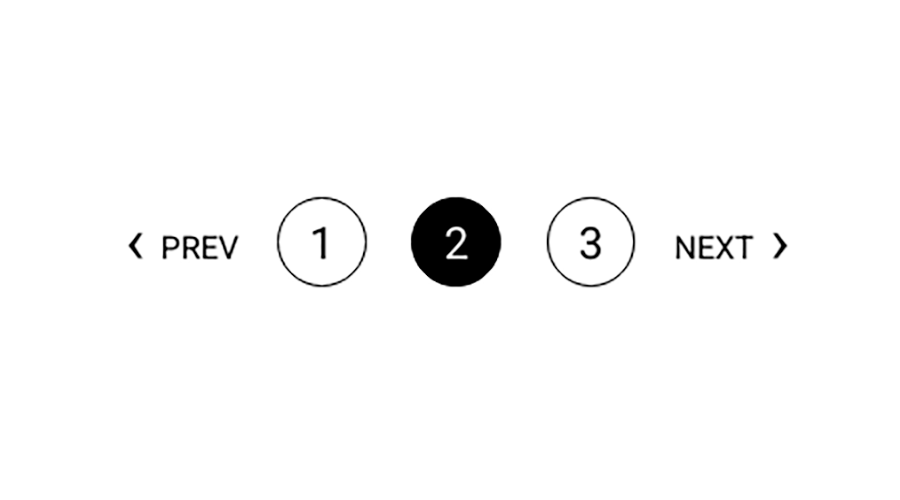

サイトのデザインを一新した際に、当初はBlogとNotesと2つに分けていた記事群を、一つにまとめた。<br>
内訳はBlog（Contentful）とNotes（Markdown）の棲み分けだったに過ぎず、他人様から見たら、なぜ分けているのか意味不明・・・どっちもBlogじゃん。を、Markdownへ合算したため、急に記事数が増えた。

個人的には、アイキャッチ画像などない全記事一覧を一望、好きなんだけども。<br>
どこまでもスクロール長が伸びていくのもな、という心境から、ページネーション（ページャー）を実装した。



見た目がこんなやつ。

<hr>

各ページへの（丸数字）を載せるまでは、サンプルコードを載せている方もおり、比較的簡単なのと、この記事の「三項演算子」本題ではないので割愛。

（丸数字）の左右にある、PREV ・ NEXT リンクを書くのに、以前の記事の
**まさに「例題」**
だったので振り返ってみた。

<hr>

画像では、**PREV ・ NEXT**
が両方表示される真ん中の「2ページ目」を撮っているが、最初と最後で、**PREV**
と
**NEXT**
は、ぞれぞれ消える。<br>


平たく1ページ目に**PREV**は不要。<br>
この場合の最終3ページでは**NEXT**が不要となる。

<span style="display: block;margin-bottom: 3em;"></span>

**NEXT**
は単純で、最後のページでは消えて欲しいので、**null**を返す。<br>
それ以外は、ずっと
**currentPage + 1**
で加算していくだけ。

```js
const nextPage = currentPage < numPages ? `/${currentPage + 1}` : null
```
全ページ数numPagesより現在ページが小さければ、nextPageは、現在ページ + 1<br>

<hr>


が、**PREV**は逆に
**currentPage - 1**
と減算していくだけでは、2ページ目の前ページは
**/1/**　や　**/blog/1/**　といったURIパスとしておかしなことになる。

一般に生成されるページ、Webページのパスは

/<br>
/2/<br>
/3/<br>

あるいは、/blog/ディレクトリ下の例で

/blog/<br>
/blog/2/<br>
/blog/3/<br>

 故に、（説明が恐ろしく長くなったが！）
 やりたいことは、
 
 1ページ目ではnull<br>
 2ページ目では "/"<br>
それ以外はすべて
**currentPage - 1** で前のページ値を渡したい。

よって、前に見覚えのあった

```JS
String str = 条件式1 ? 条件式2 ? "A" : "B" : "C";
```
の出番である。

<hr>

# 振り返り

[**条件式が複数ある三項演算子に混乱した話** - Qiita](https://qiita.com/riekure/items/e510dba2e507403d990a?utm_source=pocket_saves)

を読んだときに

[部屋とTシャツとダークモードと三項演算子](/notes/note-07-darkMode-ternaryOperator/)という記事を書いたときには、私は「三項演算子」の呼び名も知らず、（IF文だと思っていた）と正直に書いており、


を読んで（おもしろっ）と反応していた


<span style="display: block;margin-bottom: 2em;"></span>


2ページ目から currentPage - 1　を計算して
**/1/**
や
**/blog/1/**


<span style="display: block;margin-bottom: 2em;"></span>

生成されるページのPathは、ルートや

```
/
/2/
/3/
```

Gatsbyの場合、ページを生成する方法は、gatsby-node.jsの中で、createPageメソッドを使い、

/
/2/
/3/

```

```


<span style="display: block;margin-bottom: 13em;"></span>


Gatsbyの場合、ページを生成する方法は、gatsby-node.jsの中で、createPageメソッドを使い、その際「pageContext」でテンプレートに必要な値も渡せる。<br>
たとえば現在地であるカレントページなど。

```js
currentPage: i + 1,
```


<hr>


問題となったコード

```JS
String str = 条件式1 ? 条件式2 ? "A" : "B" : "C";
```
